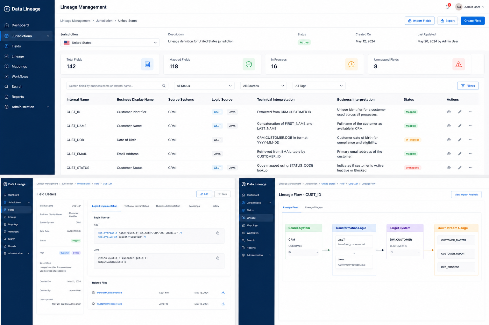
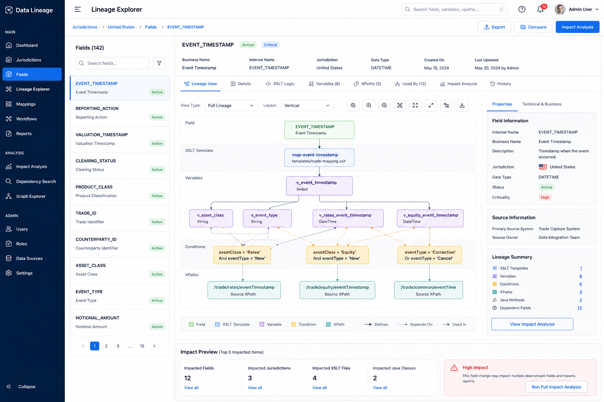
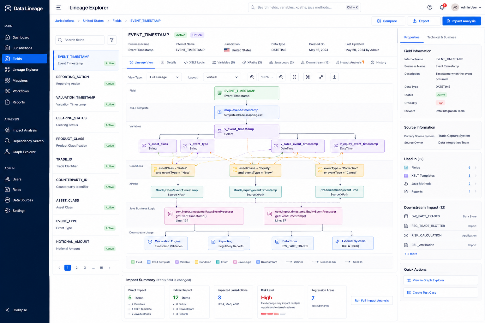
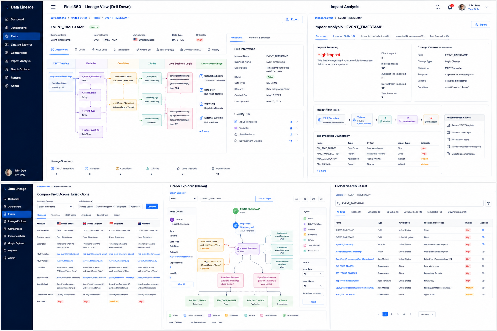

# Data Lineage Platform Requirement & Project Documentation

**Project name:** Data Lineage Platform  
**Mode:** View-only MVP  
**Frontend:** React + TypeScript  
**Backend:** Python + FastAPI  
**Operational DB:** Microsoft SQL Server  
**Graph DB:** Neo4j  
**Primary users:** BA, Developer, QA, Production Support, Regulatory SME, Application Owner

---

## 1. Executive Summary

This document defines a view-only enterprise Data Lineage Platform for regulatory reporting fields across multiple jurisdictions. The platform allows users to search fields, inspect business and technical meaning, drill down into XSLT variables and Java logic, trace XPath and downstream dependencies, run impact analysis, and compare fields across jurisdictions.

The product is intentionally split into two separate projects:

1. `lineage-backend` — Python FastAPI backend.
2. `lineage-frontend` — React frontend.

The data architecture is hybrid:

- **MSSQL** stores operational and human-reviewed metadata.
- **Neo4j** stores AST, code lineage, XSLT dependencies, Java dependencies, XPath relationships, downstream graph relationships, and impact traversal.

The frontend must not connect directly to MSSQL or Neo4j. All data access goes through the backend.

```text
React UI → Python Backend → MSSQL / Neo4j
```

---

## 2. UI Mockups

### 2.1 Initial Lineage Management Concept



This mockup shows the first concept of the Lineage Management UI with jurisdiction selection, field list, field detail, and simple lineage flow.

---

### 2.2 XSLT Drill-Down Concept



This mockup expands the lineage screen to include XSLT templates, variables, conditions, XPaths, and impact preview.

---

### 2.3 Field 360 with Java and Downstream Impact



This mockup adds the missing real-world layers: Java business logic, Java method references, downstream systems, downstream reports, direct impact, indirect impact, and regression areas.

---

### 2.4 Full Application Screen Collage



This collage shows the major application screens together: Field 360, Impact Analysis, Field Comparison, Graph Explorer, and Global Search.

---

## 3. Business Objective

Regulatory reporting platforms often have complex logic distributed across:

- XSLT files.
- XSLT variables.
- Imported XSLT templates.
- XPath mappings.
- Java classes.
- Java methods.
- Validation logic.
- Enrichment logic.
- Downstream report schemas.
- Regulatory submission gateways.
- ACK/NACK reconciliation processes.

Teams need a single operational UI to answer questions such as:

- What does this field mean from a business perspective?
- What is the technical interpretation of the field?
- Which XSLT variable populates this field?
- Which XPath feeds the variable?
- Which Java class or method enriches or validates the value?
- Which downstream systems consume the field?
- Which reports and regulatory submissions include this field?
- If this variable or XPath changes, which other fields are impacted?
- How does the same field differ across JFSA, MAS, ASIC, HKMA, ESMA, FCA, or other jurisdictions?

---

## 4. Scope

## 4.1 In Scope

The MVP shall support:

- View-only access-controlled UI.
- Jurisdiction search and summary.
- Field search and field list.
- Field 360 view.
- Business interpretation.
- Technical interpretation.
- XSLT drill-down.
- XSLT variable dependency view.
- XPath association view.
- Java class and method drill-down.
- Downstream system/report usage.
- Impact analysis.
- Field comparison across jurisdictions.
- Graph explorer backed by Neo4j.
- Global search.
- Export of allowed results.
- MSSQL seed scripts.
- Neo4j seed scripts.
- Backend access validation.

## 4.2 Out of Scope for MVP

The first version shall not support UI-based:

- Create field.
- Edit field.
- Delete field.
- Approve field.
- Reject field.
- Submit for review.
- Direct source code parsing from UI.
- Real-time production trade lookup.
- Direct writes to Neo4j from UI.

Data is inserted using controlled scripts only.

---

## 5. Users and Roles

| User Type | Purpose |
|---|---|
| Business Analyst | Understand field meaning, jurisdiction behavior, and reporting interpretation. |
| Developer | Understand XSLT, Java, XPath, and transformation logic. |
| QA Engineer | Identify test scenarios and regression areas. |
| Production Support | Investigate reporting issues and downstream impacts. |
| Regulatory SME | Validate regulatory interpretation and jurisdiction differences. |
| Application Owner | Review coverage, risk, ownership, and operational status. |

Suggested initial roles:

| Role | Access |
|---|---|
| LINEAGE_VIEWER | View screens and data. |
| LINEAGE_ANALYST | View advanced analysis and export. |
| LINEAGE_ADMIN | View all metadata and dependency health. |

The MVP is view-only, so none of these roles provide edit access from UI.

---

## 6. Data Ownership and Source of Truth

## 6.1 MSSQL Source of Truth

MSSQL stores stable operational and human-reviewed metadata.

| Data | Source |
|---|---|
| Users | MSSQL |
| Roles | MSSQL |
| Screen access | MSSQL |
| Jurisdiction access | MSSQL |
| Jurisdictions | MSSQL |
| Field internal name | MSSQL |
| Field external display name | MSSQL |
| Business name | MSSQL |
| Data type | MSSQL |
| Criticality | MSSQL |
| Owner/steward | MSSQL |
| Status | MSSQL |
| Business interpretation | MSSQL |
| Technical interpretation | MSSQL |
| Review status | MSSQL |
| Version history | MSSQL |
| Audit history | MSSQL |
| Saved comparison metadata | MSSQL, optional |
| Regression test suggestions | MSSQL, optional |

## 6.2 Neo4j Source of Truth

Neo4j stores technical graph and dependency traversal data.

| Data | Source |
|---|---|
| XSLT AST | Neo4j |
| XSLT files | Neo4j |
| XSLT templates | Neo4j |
| XSLT variables | Neo4j |
| Variable dependencies | Neo4j |
| XPath usage | Neo4j |
| XSLT conditions | Neo4j |
| Java classes | Neo4j |
| Java methods | Neo4j |
| Java method calls | Neo4j |
| Java config usage | Neo4j |
| Field-to-variable links | Neo4j |
| Variable-to-XPath links | Neo4j |
| Java-to-field links | Neo4j |
| Downstream dependency graph | Neo4j |
| Used-by traversal | Neo4j |
| Impact analysis traversal | Neo4j |

## 6.3 Frontend Responsibility

The frontend is a rendering layer only.

It may hardcode UI-level configuration such as:

- Sidebar labels.
- Icons.
- Default grid layout.
- Tab labels.
- Theme colors.
- Default page size.

It must not hardcode business lineage, XSLT lineage, Java lineage, impact data, or jurisdiction data.

---

## 7. High-Level Architecture

```text
+---------------------------+
| React Frontend            |
| - View-only UI            |
| - Grid/search/filter      |
| - Field 360 View          |
| - Field Comparison        |
| - Impact Analysis         |
| - Graph Explorer          |
+-------------+-------------+
              |
              | REST API
              v
+---------------------------+
| Python FastAPI Backend    |
| - Access validation       |
| - MSSQL repositories      |
| - Neo4j graph services    |
| - Response aggregation    |
| - Export APIs             |
+------+------+-------------+
       |      |
       v      v
+---------+  +----------------+
| MSSQL   |  | Neo4j          |
| Ops DB  |  | AST/Lineage DB |
+---------+  +----------------+
```

## 7.1 Backend Responsibilities

The backend shall:

- Validate user access.
- Read operational metadata from MSSQL.
- Read lineage graph from Neo4j.
- Merge MSSQL and Neo4j data into UI-friendly responses.
- Hide Cypher and SQL complexity from frontend.
- Apply pagination, filtering, and sorting.
- Provide export APIs.
- Enforce view-only rules.

## 7.2 Frontend Responsibilities

The frontend shall:

- Render allowed screens based on `/api/me`.
- Use a consistent enterprise UI layout.
- Render grids, filters, pagination, tabs, drawers, and modals consistently.
- Display Field 360, Impact Analysis, Field Comparison, Graph Explorer, and Global Search screens.
- Not directly access MSSQL or Neo4j.

---

## 8. Technology Stack

## 8.1 Backend

| Area | Technology |
|---|---|
| Language | Python 3.11+ |
| API Framework | FastAPI |
| Models | Pydantic |
| MSSQL Access | SQLAlchemy + pyodbc |
| Neo4j Access | Neo4j Python Driver |
| Config | pydantic-settings / `.env` |
| Logging | Python logging / structlog optional |
| Testing | pytest |
| Server | uvicorn |

## 8.2 Frontend

| Area | Technology |
|---|---|
| Language | TypeScript |
| Framework | React |
| Build Tool | Vite |
| Routing | React Router |
| Data Fetching | TanStack Query / React Query |
| Styling | CSS variables + CSS modules or plain CSS |
| Icons | Lucide React |
| Graph View | React Flow or custom SVG |
| Testing | Vitest / React Testing Library |

---

## 9. Project Structure

## 9.1 Parent Repository

```text
lineage-platform/
  lineage-backend/
  lineage-frontend/
  docs/
  scripts/
  README.md
```

---

## 9.2 Backend Project Structure

```text
lineage-backend/
  app/
    main.py
    api/
      router.py
      dependencies.py
      routes/
        health_routes.py
        auth_routes.py
        jurisdiction_routes.py
        field_routes.py
        lineage_routes.py
        comparison_routes.py
        impact_routes.py
        graph_routes.py
        lookup_routes.py
        export_routes.py
    core/
      config.py
      logging_config.py
      security.py
      exceptions.py
      response.py
      constants.py
    db/
      mssql.py
      neo4j.py
    models/
      common.py
      auth_models.py
      jurisdiction_models.py
      field_models.py
      lineage_models.py
      comparison_models.py
      impact_models.py
      graph_models.py
      lookup_models.py
    repositories/
      access_repository.py
      jurisdiction_repository.py
      field_repository.py
      interpretation_repository.py
      lookup_repository.py
    graph/
      cypher_queries.py
      lineage_graph_service.py
      impact_graph_service.py
      comparison_graph_service.py
    services/
      access_service.py
      jurisdiction_service.py
      field_service.py
      lineage_service.py
      comparison_service.py
      impact_service.py
      graph_service.py
      lookup_service.py
      export_service.py
    utils/
      pagination.py
      filters.py
      sorting.py
      mapper.py
      date_utils.py
  db/
    mssql/
      schema.sql
      indexes.sql
      seed_data.sql
      seed_access.sql
    neo4j/
      constraints.cypher
      seed_graph.cypher
  scripts/
    insert_sample_data.py
    insert_mssql_seed.py
    insert_neo4j_seed.py
    validate_connections.py
  tests/
    test_health.py
    test_access.py
    test_fields.py
    test_comparison.py
    test_impact.py
  .env.example
  requirements.txt
  README.md
```

---

## 9.3 Frontend Project Structure

```text
lineage-frontend/
  public/
    favicon.svg
  src/
    main.tsx
    App.tsx
    app/
      router.tsx
      queryClient.ts
      appConfig.ts
    components/
      layout/
        AppShell.tsx
        Sidebar.tsx
        Topbar.tsx
        PageHeader.tsx
        ContentPanel.tsx
      grid/
        DataGrid.tsx
        GridToolbar.tsx
        GridSearch.tsx
        GridFilterBar.tsx
        GridPagination.tsx
        GridActions.tsx
        GridEmptyState.tsx
        GridLoadingState.tsx
      filters/
        FilterButton.tsx
        FilterDrawer.tsx
        FilterChip.tsx
        SelectFilter.tsx
        DateRangeFilter.tsx
      modals/
        BaseModal.tsx
        DetailModal.tsx
        ConfirmModal.tsx
        ExportModal.tsx
        AccessDeniedModal.tsx
      cards/
        SummaryCard.tsx
        MetricCard.tsx
        StatusBadge.tsx
        RiskBadge.tsx
        InfoCard.tsx
      graph/
        LineageGraph.tsx
        GraphLegend.tsx
        GraphToolbar.tsx
        NodeDetailDrawer.tsx
      common/
        Button.tsx
        IconButton.tsx
        Tabs.tsx
        Breadcrumbs.tsx
        EmptyState.tsx
        LoadingSpinner.tsx
        ErrorState.tsx
    features/
      dashboard/
        DashboardPage.tsx
        dashboardApi.ts
        dashboardTypes.ts
      jurisdictions/
        JurisdictionsPage.tsx
        JurisdictionSummary.tsx
        jurisdictionApi.ts
        jurisdictionTypes.ts
      fields/
        FieldListPage.tsx
        Field360Page.tsx
        FieldHeader.tsx
        FieldSummaryPanel.tsx
        BusinessLens.tsx
        TechnicalLens.tsx
        ImplementationLens.tsx
        ImpactLens.tsx
        XsltDrilldownPanel.tsx
        JavaDrilldownPanel.tsx
        DownstreamPanel.tsx
        fieldApi.ts
        fieldTypes.ts
      comparison/
        FieldComparisonPage.tsx
        ComparisonSelector.tsx
        ComparisonGrid.tsx
        DifferenceSummaryPanel.tsx
        SharedDependenciesPanel.tsx
        comparisonApi.ts
        comparisonTypes.ts
      impact/
        ImpactAnalysisPage.tsx
        ImpactSummaryCards.tsx
        ImpactedFieldsGrid.tsx
        RegressionSuggestionsPanel.tsx
        impactApi.ts
        impactTypes.ts
      graphExplorer/
        GraphExplorerPage.tsx
        GraphSearchPanel.tsx
        GraphCanvas.tsx
        graphApi.ts
        graphTypes.ts
      access/
        AccessDeniedPage.tsx
        accessApi.ts
        accessTypes.ts
    hooks/
      usePagination.ts
      useFilters.ts
      useSorting.ts
      useDebounce.ts
      useAccess.ts
    services/
      apiClient.ts
      errorHandler.ts
      exportService.ts
    styles/
      variables.css
      global.css
      layout.css
      grid.css
      modal.css
      graph.css
    types/
      api.ts
      common.ts
  .env.example
  package.json
  vite.config.ts
  tsconfig.json
  README.md
```

---

## 10. UI Design Standards

## 10.1 Application Layout

All screens shall follow this structure:

```text
<AppShell>
  <Sidebar />
  <MainArea>
    <Topbar />
    <PageHeader />
    <Toolbar />
    <ContentArea />
  </MainArea>
</AppShell>
```

## 10.2 Common Layout Dimensions

| Area | Standard |
|---|---|
| Sidebar | 240px expanded, 72px collapsed |
| Topbar | 64px height |
| Page Header | 72px to 120px |
| Toolbar | 56px minimum |
| Grid Row Height | 52px |
| Right Drawer | 420px to 520px |
| Standard Modal | 560px / 720px / 960px variants |

## 10.3 Visual Style

The UI shall use:

- Dark navy sidebar.
- Light main content background.
- White cards.
- Subtle borders.
- Rounded corners.
- Compact but readable data grids.
- Consistent badges for status and risk.
- Clear selected row state.

Suggested CSS variables:

```css
:root {
  --color-bg: #f6f8fb;
  --color-surface: #ffffff;
  --color-sidebar: #082044;
  --color-primary: #1267e8;
  --color-primary-soft: #e8f1ff;
  --color-border: #d8e0ea;
  --color-text: #102033;
  --color-muted: #667085;
  --color-success: #14804a;
  --color-warning: #b7791f;
  --color-danger: #d92d20;
  --radius-sm: 6px;
  --radius-md: 10px;
  --radius-lg: 14px;
  --shadow-card: 0 1px 3px rgba(16, 32, 51, 0.08);
}
```

---

## 11. Standard Grid Requirements

All list screens shall use the same reusable `DataGrid` component.

Used by:

- Field list.
- Jurisdiction list.
- Impacted fields list.
- Comparison results.
- Downstream systems list.
- Used-by list.
- Graph search results.

## 11.1 Grid Features

Every grid shall support:

- Search.
- Filters.
- Sorting.
- Pagination.
- Row click.
- Row actions.
- Loading state.
- Empty state.
- Error state.
- Access denied state.
- Export action where allowed.

## 11.2 Grid Toolbar

```text
Search box | Filter Button | Active Filter Chips | Refresh | Export
```

Search behavior:

- Debounce by 300ms.
- Minimum 2 characters before server search.
- Pressing Enter triggers search.
- Clear icon resets search.

## 11.3 Filters

Common filters:

- Jurisdiction.
- Status.
- Criticality.
- Owner.
- Source type.
- Business concept.
- Downstream system.
- Impact type.
- Risk level.

Filter behavior:

- Apply button applies filters.
- Reset clears filters.
- Applied filters show as chips.
- Removing a chip refreshes the grid.

## 11.4 Pagination

Pagination shall be server-side.

Standard parameters:

```text
page=1
pageSize=25
sortBy=businessName
sortDirection=asc
```

Allowed page sizes:

- 10.
- 25.
- 50.
- 100.

## 11.5 View-Only Row Actions

Allowed actions:

- View Details.
- Open Field 360.
- View Lineage.
- View Impact.
- Compare.
- Export.

Not allowed in MVP:

- Edit.
- Delete.
- Approve.
- Reject.
- Submit for review.

---

## 12. Modal and Drawer Standards

## 12.1 Modal Types

- Detail modal.
- Export modal.
- Access denied modal.
- Information modal.
- Error modal.

No create/edit modals are required for the view-only MVP.

## 12.2 Right Drawer Usage

Right drawers shall be used for drill-down without leaving the screen.

Used for:

- XSLT variable detail.
- XPath detail.
- Java method detail.
- Downstream system detail.
- Difference detail.
- Graph node detail.
- Access explanation.

---

## 13. Screen Requirements

## 13.1 Dashboard Screen

Purpose: Provide high-level visibility into lineage coverage and risk.

Sections:

- Total jurisdictions.
- Total fields.
- Fields with complete lineage.
- Fields missing business interpretation.
- Fields missing technical interpretation.
- High-risk fields.
- Recent changes.
- Top impacted dependencies.

Actions:

- Open jurisdiction.
- Open field list.
- Open impact analysis.

---

## 13.2 Jurisdiction Screen

Purpose: Show summary of all accessible jurisdictions.

Grid columns:

- Jurisdiction code.
- Jurisdiction name.
- Region.
- Regulator.
- Reporting regime.
- Total fields.
- High-risk fields.
- Lineage coverage.
- Status.

Actions:

- View fields.
- View comparison.
- View jurisdiction summary.

---

## 13.3 Field List Screen

Purpose: Search and view fields across jurisdictions.

Grid columns:

- Internal field name.
- Business name.
- External display name.
- Jurisdiction.
- Data type.
- Criticality.
- Status.
- Source coverage.
- Downstream count.
- Actions.

Actions:

- Open Field 360.
- View Lineage.
- View Impact.
- Compare.

---

## 13.4 Field 360 Screen

Purpose: Provide a full operational view of one selected field.

Header:

- Internal field name.
- Business name.
- External display name.
- Jurisdiction.
- Status.
- Criticality.
- Owner.

Tabs/lenses:

- Overview.
- Business Lens.
- Technical Lens.
- Implementation Lens.
- Impact Lens.
- XSLT Drilldown.
- Java Drilldown.
- Downstream.
- History.

The screen shall show:

- Business interpretation.
- Technical interpretation.
- XSLT variables and conditions.
- XPath sources.
- Java methods/classes/config keys.
- Downstream systems and reports.
- Impact summary.
- Suggested regression tests.

---

## 13.5 XSLT Drill-Down Screen/Tab

The XSLT drill-down shall show the field as an explorable dependency tree.

Example:

```text
External Field: Event Timestamp

└── Output XPath: /report/eventTimestamp
    └── Template: map-event-timestamp
        └── Variable: v_event_timestamp
            ├── Condition: assetClass = 'Rates'
            │   └── Variable: v_rates_event_timestamp
            │       └── XPath: /trade/rates/eventTimestamp
            ├── Condition: assetClass = 'Credit'
            │   └── Variable: v_credit_event_timestamp
            │       └── XPath: /trade/credit/eventTimestamp
            └── Fallback Variable: v_default_event_timestamp
                └── XPath: /trade/tradeHeader/eventTimestamp
```

Each node shall show:

- Node type.
- Node name.
- XSLT file.
- Line number if available.
- Definition snippet.
- Depends-on relationship.
- Used-by relationship.
- Related XPath.
- Related condition.

---

## 13.6 Java Drill-Down Screen/Tab

The Java panel shall show:

- Application name.
- Module name.
- Package name.
- Class name.
- Method name.
- Method responsibility.
- Mapping logic.
- Validation logic.
- Enrichment logic.
- Defaulting logic.
- Exception handling.
- Config keys.
- Source fields read.
- Other methods called.
- XSLT variables or output fields affected.
- Downstream fields impacted.

Example:

```text
Field: EVENT_TIMESTAMP

Java Logic:
- Module: regulatory-transformer
- Class: EventTimestampMapper
- Method: mapEventTimestamp()
- Responsibility: Normalize event timestamp and apply jurisdiction-specific fallback.

Reads:
- trade.eventTimestamp
- trade.processingTimestamp
- jurisdictionConfig.timezone

Applies:
- UTC normalization
- Null fallback
- Event type validation
```

---

## 13.7 Downstream Screen/Tab

The downstream panel shall show:

- Downstream systems.
- Downstream reports.
- External schemas.
- Regulatory submission channels.
- Validation rules.
- ACK/NACK checks.
- Reconciliation processes.
- Data warehouse tables.
- Monitoring dashboards.
- Dependent fields.
- Dependent transformations.

Example:

```text
Downstream Impact for EVENT_TIMESTAMP:

Systems:
- DTCC GTR Submission Gateway
- Regulatory Data Warehouse
- ACK/NACK Reconciliation
- Exception Dashboard
- Operations Investigation UI

Reports:
- JFSA Trade Report
- MAS OTC Derivatives Report
- ASIC Transaction Report
```

---

## 13.8 Impact Analysis Screen

Purpose: Analyze impact from field, variable, XPath, Java method, condition, or downstream system.

Controls:

- Impact source type selector.
- Source node search.
- Depth selector.
- Jurisdiction filter.
- Run analysis button.

Sections:

- Impact summary cards.
- Direct impacted fields.
- Indirect impacted fields.
- Impacted jurisdictions.
- Impacted Java logic.
- Impacted XSLT logic.
- Downstream reports.
- Suggested regression tests.

Impact response shall include:

- Direct impacted fields.
- Indirect impacted fields.
- Impacted jurisdictions.
- Impacted XSLT files.
- Impacted Java methods/classes.
- Downstream reports.
- Risk level.
- Suggested regression scenarios.

---

## 13.9 Field Comparison Screen

Purpose: Compare a common business concept across multiple jurisdictions.

This is a separate screen and shall not be embedded inside Field 360.

Top controls:

- Business concept selector.
- Jurisdiction multi-select.
- Comparison mode selector.
- Compare button.
- Export button.

Comparison modes:

- Full.
- Business.
- Technical.
- XSLT.
- Java.
- XPath.
- Downstream.
- Impact.

Main grid format:

```text
Attribute | JFSA | MAS | ASIC | HKMA | Difference Type | Risk
```

Example:

```text
Business Field: Event Timestamp

+----------------------+------------------+------------------+------------------+
| Attribute            | JFSA             | MAS              | ASIC             |
+----------------------+------------------+------------------+------------------+
| Internal Name        | T_EVENT_TS       | EVENT_TIMESTAMP  | EVT_TIMESTAMP    |
| External Name        | Event Timestamp  | Event Time       | Execution Time   |
| Business Meaning     | Lifecycle event  | Reportable event | Execution event  |
| XSLT Variable        | v_event_ts       | v_event_time     | v_execution_ts   |
| Java Method          | mapEventTs()     | mapEventTime()   | mapExecutionTs() |
| Source XPath         | /trade/event/ts  | /trade/life/time | /trade/exec/time |
| Downstream Report    | JFSA Report      | MAS Report       | ASIC Report      |
| Risk                 | High             | Medium           | High             |
+----------------------+------------------+------------------+------------------+
```

The UI shall highlight:

- Same values.
- Different values.
- Missing values.
- Jurisdiction-specific overrides.
- Common shared dependencies.
- High-risk differences.

---

## 13.10 Graph Explorer Screen

Purpose: Explore Neo4j lineage graph interactively.

Features:

- Search graph nodes.
- Filter by node type.
- Expand neighbors.
- View node details.
- Find path between nodes.
- Open selected field in Field 360.
- Run impact analysis from selected node.

---

## 13.11 Global Search Screen

Purpose: Search across fields, variables, XPaths, Java methods, templates, downstream systems, and reports.

Result columns:

- Name.
- Type.
- Jurisdiction.
- Location/reference.
- Impact level.
- Actions.

---

## 14. API List

## 14.1 Health APIs

| Method | API | Purpose |
|---|---|---|
| GET | `/api/health` | Check backend health. |
| GET | `/api/health/dependencies` | Check MSSQL and Neo4j connectivity. |

## 14.2 User / Access APIs

| Method | API | Purpose |
|---|---|---|
| GET | `/api/me` | Get current user, roles, allowed screens, allowed jurisdictions, permissions. |

## 14.3 Lookup APIs

| Method | API | Purpose |
|---|---|---|
| GET | `/api/lookups/jurisdictions` | Dropdown list of jurisdictions. |
| GET | `/api/lookups/business-concepts` | Dropdown list of comparable business concepts. |
| GET | `/api/lookups/criticalities` | Criticality values. |
| GET | `/api/lookups/statuses` | Field status values. |
| GET | `/api/lookups/source-types` | Source type values. |
| GET | `/api/lookups/node-types` | Graph node types. |
| GET | `/api/lookups/impact-types` | Impact type values. |
| GET | `/api/lookups/downstream-systems` | Downstream system dropdown. |

## 14.4 Dashboard APIs

| Method | API | Purpose |
|---|---|---|
| GET | `/api/dashboard/summary` | Overall dashboard metrics. |
| GET | `/api/dashboard/lineage-coverage` | Lineage coverage by jurisdiction. |
| GET | `/api/dashboard/high-risk-fields` | High-risk fields summary. |
| GET | `/api/dashboard/recent-changes` | Recently changed fields/lineage items. |
| GET | `/api/dashboard/top-impacted-dependencies` | Most reused/high-impact dependencies. |

## 14.5 Jurisdiction APIs

| Method | API | Purpose |
|---|---|---|
| GET | `/api/jurisdictions` | List jurisdictions user can access. |
| GET | `/api/jurisdictions/{jurisdictionCode}` | Get jurisdiction details. |
| GET | `/api/jurisdictions/{jurisdictionCode}/summary` | Get jurisdiction-level summary. |
| GET | `/api/jurisdictions/{jurisdictionCode}/fields/summary` | Field count and coverage for jurisdiction. |

## 14.6 Field APIs

| Method | API | Purpose |
|---|---|---|
| GET | `/api/fields` | Search fields across accessible jurisdictions. |
| GET | `/api/jurisdictions/{jurisdictionCode}/fields` | List fields for one jurisdiction. |
| GET | `/api/fields/{fieldId}` | Get Field 360 summary. |
| GET | `/api/fields/{fieldId}/overview` | Field overview. |
| GET | `/api/fields/{fieldId}/business` | Business interpretation. |
| GET | `/api/fields/{fieldId}/technical` | Technical interpretation. |
| GET | `/api/fields/{fieldId}/used-by` | Used-by summary. |
| GET | `/api/fields/{fieldId}/downstream` | Downstream usage. |
| GET | `/api/fields/{fieldId}/history` | Field version/review history. |
| GET | `/api/fields/{fieldId}/audit` | Audit trail for field. |

Field list query parameters:

```text
search=event timestamp
jurisdiction=JFSA
criticality=HIGH
status=APPROVED
sourceType=XSLT
page=1
pageSize=25
sortBy=businessName
sortDirection=asc
```

## 14.7 XSLT Lineage APIs

| Method | API | Purpose |
|---|---|---|
| GET | `/api/fields/{fieldId}/xslt-drilldown` | XSLT template, variables, conditions, XPath drill-down. |
| GET | `/api/fields/{fieldId}/xslt/templates` | Templates used by field. |
| GET | `/api/fields/{fieldId}/xslt/variables` | Variables used by field. |
| GET | `/api/fields/{fieldId}/xslt/conditions` | Conditions affecting field. |
| GET | `/api/fields/{fieldId}/xslt/xpaths` | XPaths used by field. |
| GET | `/api/variables/{variableName}` | Variable detail. |
| GET | `/api/variables/{variableName}/depends-on` | What the variable depends on. |
| GET | `/api/variables/{variableName}/used-by` | Fields/templates/variables using this variable. |
| GET | `/api/xpaths/used-by?xpath={xpath}` | Fields/variables using selected XPath. |

## 14.8 Java Lineage APIs

| Method | API | Purpose |
|---|---|---|
| GET | `/api/fields/{fieldId}/java-drilldown` | Java classes/methods/config keys for field. |
| GET | `/api/fields/{fieldId}/java/classes` | Java classes related to field. |
| GET | `/api/fields/{fieldId}/java/methods` | Java methods related to field. |
| GET | `/api/java-methods/{methodName}` | Java method detail. |
| GET | `/api/java-methods/{methodName}/used-by` | Fields using selected Java method. |
| GET | `/api/java-methods/{methodName}/depends-on` | Other methods/config/source fields used by method. |
| GET | `/api/java-classes/{className}` | Java class detail. |

## 14.9 Downstream APIs

| Method | API | Purpose |
|---|---|---|
| GET | `/api/fields/{fieldId}/downstream/systems` | Downstream systems consuming field. |
| GET | `/api/fields/{fieldId}/downstream/reports` | Downstream reports using field. |
| GET | `/api/fields/{fieldId}/downstream/validations` | Downstream validation / ACK-NACK rules. |
| GET | `/api/fields/{fieldId}/downstream/tables` | Warehouse/reporting tables storing field. |
| GET | `/api/downstream-systems/{systemCode}` | Downstream system detail. |
| GET | `/api/downstream-systems/{systemCode}/fields` | Fields consumed by downstream system. |

## 14.10 Impact Analysis APIs

| Method | API | Purpose |
|---|---|---|
| GET | `/api/fields/{fieldId}/impact-analysis` | Impact if selected field changes. |
| GET | `/api/variables/{variableName}/impact-analysis` | Impact if XSLT variable changes. |
| GET | `/api/xpaths/impact-analysis?xpath={xpath}` | Impact if XPath changes. |
| GET | `/api/java-methods/{methodName}/impact-analysis` | Impact if Java method changes. |
| GET | `/api/conditions/{conditionId}/impact-analysis` | Impact if condition changes. |
| POST | `/api/impact-analysis/run` | Generic impact analysis request. |

Generic impact request:

```json
{
  "sourceType": "XSLT_VARIABLE",
  "sourceValue": "v_event_timestamp",
  "jurisdictions": ["JFSA", "MAS", "ASIC"],
  "maxDepth": 6,
  "includeDownstream": true,
  "includeRegressionTests": true
}
```

## 14.11 Field Comparison APIs

| Method | API | Purpose |
|---|---|---|
| GET | `/api/comparison/business-concepts` | List comparable business concepts. |
| POST | `/api/comparison/fields` | Compare selected business concept across jurisdictions. |
| POST | `/api/comparison/business` | Compare business interpretations. |
| POST | `/api/comparison/technical` | Compare technical interpretations. |
| POST | `/api/comparison/xslt` | Compare XSLT variables/templates/conditions/XPaths. |
| POST | `/api/comparison/java` | Compare Java classes/methods/config keys. |
| POST | `/api/comparison/downstream` | Compare downstream usage. |
| POST | `/api/comparison/impact` | Compare impact across jurisdictions. |

Example request:

```json
{
  "businessConcept": "Event Timestamp",
  "jurisdictions": ["JFSA", "MAS", "ASIC", "HKMA"],
  "comparisonMode": "FULL"
}
```

## 14.12 Graph Explorer APIs

| Method | API | Purpose |
|---|---|---|
| POST | `/api/graph/search` | Search Neo4j graph nodes. |
| GET | `/api/graph/node/{nodeId}` | Get graph node details. |
| GET | `/api/graph/neighbors/{nodeId}` | Get neighboring graph nodes. |
| POST | `/api/graph/path` | Find path between two nodes. |
| POST | `/api/graph/expand` | Expand graph from selected node. |
| POST | `/api/graph/subgraph` | Get subgraph for selected field/variable/method. |

## 14.13 Global Search APIs

| Method | API | Purpose |
|---|---|---|
| GET | `/api/search/global` | Search fields, variables, XPaths, Java methods, downstream systems. |
| GET | `/api/search/suggestions` | Typeahead search suggestions. |

## 14.14 Export APIs

| Method | API | Purpose |
|---|---|---|
| POST | `/api/export/fields` | Export field list. |
| POST | `/api/export/field-360` | Export Field 360 details. |
| POST | `/api/export/comparison` | Export comparison result. |
| POST | `/api/export/impact-analysis` | Export impact analysis. |
| POST | `/api/export/graph` | Export graph/subgraph data. |

Supported export formats:

- CSV.
- Excel.
- JSON.
- PDF.

---

## 15. API Response Standards

## 15.1 Single Object Response

```json
{
  "success": true,
  "data": {},
  "message": null,
  "errors": []
}
```

## 15.2 Paginated Response

```json
{
  "success": true,
  "data": {
    "items": [],
    "page": 1,
    "pageSize": 25,
    "totalItems": 142,
    "totalPages": 6,
    "hasNext": true,
    "hasPrevious": false
  },
  "message": null,
  "errors": []
}
```

## 15.3 Error Response

```json
{
  "success": false,
  "data": null,
  "message": "Access denied",
  "errors": [
    {
      "code": "ACCESS_DENIED",
      "field": null,
      "detail": "User does not have access to this jurisdiction."
    }
  ]
}
```

---

## 16. Access Validation Requirements

## 16.1 Security Scope

The MVP is view-only. The backend validates whether the user can access requested information.

Access validation applies to:

- Screens.
- Jurisdictions.
- Fields.
- Field comparison results.
- Impact analysis results.
- Neo4j graph traversal results.
- Downstream system views.
- Export requests.

## 16.2 Access Rules

The backend shall check:

- User exists and is active.
- User has valid role.
- User has access to requested screen.
- User has access to requested jurisdiction.
- User has access to requested field.
- User has access to comparison jurisdictions.
- User has access to downstream metadata if required.

## 16.3 Access Tables

```sql
CREATE TABLE app_users (
    user_id BIGINT IDENTITY(1,1) PRIMARY KEY,
    username VARCHAR(100) NOT NULL UNIQUE,
    display_name VARCHAR(255) NOT NULL,
    email VARCHAR(255) NULL,
    status VARCHAR(50) NOT NULL DEFAULT 'ACTIVE',
    created_at DATETIME2 NOT NULL DEFAULT SYSUTCDATETIME()
);

CREATE TABLE app_roles (
    role_id BIGINT IDENTITY(1,1) PRIMARY KEY,
    role_name VARCHAR(100) NOT NULL UNIQUE,
    description VARCHAR(MAX) NULL
);

CREATE TABLE app_user_roles (
    user_id BIGINT NOT NULL,
    role_id BIGINT NOT NULL,
    PRIMARY KEY (user_id, role_id),
    FOREIGN KEY (user_id) REFERENCES app_users(user_id),
    FOREIGN KEY (role_id) REFERENCES app_roles(role_id)
);

CREATE TABLE app_screen_access (
    screen_access_id BIGINT IDENTITY(1,1) PRIMARY KEY,
    role_id BIGINT NOT NULL,
    screen_code VARCHAR(100) NOT NULL,
    can_view BIT NOT NULL DEFAULT 1,
    FOREIGN KEY (role_id) REFERENCES app_roles(role_id)
);

CREATE TABLE app_jurisdiction_access (
    jurisdiction_access_id BIGINT IDENTITY(1,1) PRIMARY KEY,
    role_id BIGINT NOT NULL,
    jurisdiction_code VARCHAR(50) NOT NULL,
    can_view BIT NOT NULL DEFAULT 1,
    FOREIGN KEY (role_id) REFERENCES app_roles(role_id)
);
```

---

## 17. MSSQL Data Model

MSSQL stores operational, relational, review, ownership, and audit data.

## 17.1 Jurisdictions

```sql
CREATE TABLE jurisdictions (
    jurisdiction_id BIGINT IDENTITY(1,1) PRIMARY KEY,
    jurisdiction_code VARCHAR(50) NOT NULL UNIQUE,
    jurisdiction_name VARCHAR(255) NOT NULL,
    region VARCHAR(100) NULL,
    regulator_name VARCHAR(255) NULL,
    reporting_regime VARCHAR(255) NULL,
    description VARCHAR(MAX) NULL,
    owner_team VARCHAR(255) NULL,
    status VARCHAR(50) NOT NULL DEFAULT 'ACTIVE',
    created_by VARCHAR(100) NOT NULL,
    created_at DATETIME2 NOT NULL DEFAULT SYSUTCDATETIME(),
    updated_by VARCHAR(100) NULL,
    updated_at DATETIME2 NULL
);
```

## 17.2 Regulatory Fields

```sql
CREATE TABLE regulatory_fields (
    field_id BIGINT IDENTITY(1,1) PRIMARY KEY,
    jurisdiction_id BIGINT NOT NULL,
    internal_field_name VARCHAR(255) NOT NULL,
    external_display_name VARCHAR(255) NOT NULL,
    business_name VARCHAR(255) NULL,
    data_type VARCHAR(100) NULL,
    field_category VARCHAR(255) NULL,
    reporting_section VARCHAR(255) NULL,
    is_mandatory BIT NOT NULL DEFAULT 0,
    criticality VARCHAR(50) NOT NULL DEFAULT 'MEDIUM',
    owner_team VARCHAR(255) NULL,
    status VARCHAR(50) NOT NULL DEFAULT 'DRAFT',
    description VARCHAR(MAX) NULL,
    current_version INT NOT NULL DEFAULT 1,
    created_by VARCHAR(100) NOT NULL,
    created_at DATETIME2 NOT NULL DEFAULT SYSUTCDATETIME(),
    updated_by VARCHAR(100) NULL,
    updated_at DATETIME2 NULL,
    CONSTRAINT fk_regulatory_fields_jurisdiction
        FOREIGN KEY (jurisdiction_id) REFERENCES jurisdictions(jurisdiction_id),
    CONSTRAINT uq_regulatory_field_per_jurisdiction
        UNIQUE (jurisdiction_id, internal_field_name)
);
```

## 17.3 Field Interpretations

```sql
CREATE TABLE field_interpretations (
    interpretation_id BIGINT IDENTITY(1,1) PRIMARY KEY,
    field_id BIGINT NOT NULL,
    business_interpretation VARCHAR(MAX) NULL,
    technical_interpretation VARCHAR(MAX) NULL,
    example_scenario VARCHAR(MAX) NULL,
    assumptions VARCHAR(MAX) NULL,
    version_no INT NOT NULL DEFAULT 1,
    status VARCHAR(50) NOT NULL DEFAULT 'DRAFT',
    created_by VARCHAR(100) NOT NULL,
    created_at DATETIME2 NOT NULL DEFAULT SYSUTCDATETIME(),
    updated_by VARCHAR(100) NULL,
    updated_at DATETIME2 NULL,
    CONSTRAINT fk_field_interpretations_field
        FOREIGN KEY (field_id) REFERENCES regulatory_fields(field_id)
);
```

## 17.4 Review Workflow

```sql
CREATE TABLE review_workflow (
    review_id BIGINT IDENTITY(1,1) PRIMARY KEY,
    field_id BIGINT NOT NULL,
    status VARCHAR(50) NOT NULL,
    submitted_by VARCHAR(100) NULL,
    submitted_at DATETIME2 NULL,
    reviewed_by VARCHAR(100) NULL,
    reviewed_at DATETIME2 NULL,
    reviewer_comments VARCHAR(MAX) NULL,
    created_at DATETIME2 NOT NULL DEFAULT SYSUTCDATETIME(),
    CONSTRAINT fk_review_workflow_field
        FOREIGN KEY (field_id) REFERENCES regulatory_fields(field_id)
);
```

## 17.5 Field Versions

```sql
CREATE TABLE field_versions (
    version_id BIGINT IDENTITY(1,1) PRIMARY KEY,
    field_id BIGINT NOT NULL,
    version_no INT NOT NULL,
    snapshot_json NVARCHAR(MAX) NOT NULL,
    change_reason VARCHAR(MAX) NULL,
    changed_by VARCHAR(100) NOT NULL,
    changed_at DATETIME2 NOT NULL DEFAULT SYSUTCDATETIME(),
    CONSTRAINT fk_field_versions_field
        FOREIGN KEY (field_id) REFERENCES regulatory_fields(field_id),
    CONSTRAINT uq_field_version
        UNIQUE (field_id, version_no)
);
```

## 17.6 Audit Log

```sql
CREATE TABLE audit_log (
    audit_id BIGINT IDENTITY(1,1) PRIMARY KEY,
    entity_type VARCHAR(100) NOT NULL,
    entity_id BIGINT NULL,
    action_type VARCHAR(100) NOT NULL,
    old_value NVARCHAR(MAX) NULL,
    new_value NVARCHAR(MAX) NULL,
    performed_by VARCHAR(100) NOT NULL,
    performed_at DATETIME2 NOT NULL DEFAULT SYSUTCDATETIME(),
    remarks VARCHAR(MAX) NULL
);
```

---

## 18. Neo4j Graph Model

## 18.1 Node Types

| Node Label | Purpose |
|---|---|
| Jurisdiction | Regulatory jurisdiction. |
| BusinessConcept | Common business concept across jurisdictions. |
| Field | Regulatory/internal field. |
| ExternalField | External regulator-facing field. |
| XsltFile | XSLT file. |
| XsltTemplate | XSLT template. |
| XsltVariable | XSLT variable. |
| XsltCondition | XSLT if/choose/when/otherwise condition. |
| XPath | Source or output XPath. |
| JavaClass | Java class. |
| JavaMethod | Java method. |
| SourceSystem | Upstream system. |
| SourceField | Source table column/canonical field. |
| Rule | Validation/defaulting/enrichment rule. |
| DownstreamSystem | Target consuming system. |
| DownstreamReport | Downstream report/payload. |
| ValidationRule | Validation rule. |
| AckNackRule | ACK/NACK rule. |
| DataWarehouseTable | Warehouse/reporting table. |
| MonitoringDashboard | Monitoring dashboard. |
| ConfigKey | Configuration key. |
| TestScenario | Regression scenario. |

## 18.2 Relationship Types

| Relationship | Meaning |
|---|---|
| IMPLEMENTS_CONCEPT | Field implements common business concept. |
| BELONGS_TO_JURISDICTION | Field belongs to jurisdiction. |
| MAPS_TO_EXTERNAL_FIELD | Internal field maps to external field. |
| PRODUCED_BY_TEMPLATE | Field is produced by XSLT template. |
| PRODUCED_BY_VARIABLE | Field is produced by XSLT variable. |
| DEFINED_IN_FILE | Variable/template/method is defined in source file. |
| TEMPLATE_USES_VARIABLE | Template uses XSLT variable. |
| VARIABLE_DEPENDS_ON_VARIABLE | Variable depends on another variable. |
| VARIABLE_READS_XPATH | Variable reads XPath. |
| FIELD_WRITES_XPATH | Field writes output XPath. |
| CONTROLLED_BY_CONDITION | Field/variable/template controlled by condition. |
| CONDITION_DEPENDS_ON_VARIABLE | Condition uses variable. |
| CONDITION_READS_XPATH | Condition reads XPath. |
| TEMPLATE_CALLS_TEMPLATE | Template calls another template. |
| FILE_IMPORTS_FILE | XSLT import/include relationship. |
| ENRICHED_BY_METHOD | Field/variable enriched by Java method. |
| VALIDATED_BY_METHOD | Field/variable validated by Java method. |
| METHOD_CALLS_METHOD | Java method calls another method. |
| METHOD_USES_CONFIG | Method uses config key. |
| METHOD_READS_XPATH | Method reads XPath/source field. |
| METHOD_WRITES_FIELD | Method writes/updates field. |
| FIELD_CONSUMED_BY_SYSTEM | Field consumed by downstream system. |
| FIELD_USED_IN_REPORT | Field appears in downstream report. |
| FIELD_VALIDATED_BY_RULE | Field validated by rule. |
| FIELD_STORED_IN_TABLE | Field stored in warehouse/reporting table. |
| FIELD_MONITORED_BY_DASHBOARD | Field visible in dashboard. |
| REPORT_SENT_TO_REGULATOR | Report submitted to regulator or trade repository. |
| HAS_TEST_SCENARIO | Field/dependency has regression scenario. |
| HAS_JURISDICTION_OVERRIDE | Field has jurisdiction-specific logic. |
| SHARES_DEPENDENCY_WITH | Field shares dependency with another jurisdiction field. |

---

## 19. Example Cypher Queries

## 19.1 Field Dependency Drill-Down

```cypher
MATCH path = (f:Field {internalName: $internalFieldName})
  -[:PRODUCED_BY_TEMPLATE|PRODUCED_BY_VARIABLE|TEMPLATE_USES_VARIABLE|VARIABLE_DEPENDS_ON_VARIABLE|VARIABLE_READS_XPATH|CONTROLLED_BY_CONDITION|CONDITION_DEPENDS_ON_VARIABLE|CONDITION_READS_XPATH|TEMPLATE_CALLS_TEMPLATE*1..5]->(n)
RETURN path;
```

## 19.2 Variable Impact Analysis

```cypher
MATCH path = (changed:XsltVariable {name: $variableName})
  <-[:VARIABLE_DEPENDS_ON_VARIABLE|TEMPLATE_USES_VARIABLE|PRODUCED_BY_VARIABLE|PRODUCED_BY_TEMPLATE|CONTROLLED_BY_CONDITION|CONDITION_DEPENDS_ON_VARIABLE*1..8]-(f:Field)
RETURN DISTINCT f.internalName AS impactedField,
       f.businessName AS businessName,
       f.criticality AS criticality,
       length(path) AS distance
ORDER BY distance ASC;
```

## 19.3 XPath Impact Analysis

```cypher
MATCH path = (x:XPath {path: $xpath})
  <-[:VARIABLE_READS_XPATH|CONDITION_READS_XPATH]-(v)
  <-[:VARIABLE_DEPENDS_ON_VARIABLE|TEMPLATE_USES_VARIABLE|PRODUCED_BY_VARIABLE|PRODUCED_BY_TEMPLATE|CONTROLLED_BY_CONDITION*1..8]-(f:Field)
RETURN DISTINCT f.internalName AS impactedField,
       f.businessName AS businessName,
       f.criticality AS criticality,
       labels(v) AS viaNodeType,
       v.name AS viaNodeName;
```

## 19.4 Java Method Impact

```cypher
MATCH path = (m:JavaMethod {name: $methodName})
  -[:METHOD_WRITES_FIELD|METHOD_IMPACTS_DOWNSTREAM|VALIDATED_BY_METHOD|ENRICHED_BY_METHOD|METHOD_CALLS_METHOD*1..6]-(n)
OPTIONAL MATCH (f:Field)-[:FIELD_CONSUMED_BY_SYSTEM]->(ds:DownstreamSystem)
WHERE n = f OR (n)-[*1..3]-(f)
RETURN DISTINCT f.internalName AS impactedField,
       f.businessName AS businessName,
       ds.name AS downstreamSystem,
       length(path) AS distance;
```

## 19.5 Compare Business Concept Across Jurisdictions

```cypher
MATCH (bc:BusinessConcept {name: $businessConcept})<-[:IMPLEMENTS_CONCEPT]-(f:Field)
WHERE f.jurisdictionCode IN $jurisdictions
OPTIONAL MATCH (f)-[:PRODUCED_BY_VARIABLE]->(v:XsltVariable)
OPTIONAL MATCH (f)-[:ENRICHED_BY_METHOD|VALIDATED_BY_METHOD]->(m:JavaMethod)
OPTIONAL MATCH (f)-[:FIELD_CONSUMED_BY_SYSTEM]->(ds:DownstreamSystem)
RETURN f.jurisdictionCode AS jurisdiction,
       f.internalName AS internalName,
       f.businessName AS businessName,
       collect(DISTINCT v.name) AS xsltVariables,
       collect(DISTINCT m.name) AS javaMethods,
       collect(DISTINCT ds.name) AS downstreamSystems;
```

---

## 20. Insert / Seed Script Requirements

Because the MVP is view-only, data is loaded using dedicated scripts.

Scripts:

```text
lineage-backend/scripts/
  insert_sample_data.py
  insert_mssql_seed.py
  insert_neo4j_seed.py
  validate_connections.py
```

## 20.1 Execution

```bash
python scripts/validate_connections.py
python scripts/insert_mssql_seed.py
python scripts/insert_neo4j_seed.py
python scripts/insert_sample_data.py
```

Combined:

```bash
python scripts/insert_sample_data.py --reset false --environment local
```

## 20.2 Script Requirements

Scripts shall:

- Read configuration from `.env`.
- Validate MSSQL connection.
- Validate Neo4j connection.
- Insert data in deterministic order.
- Avoid duplicates using natural keys.
- Print execution summary.
- Fail fast on connection issues.
- Log inserted, skipped, and failed records.
- Support dry-run mode.

Example options:

```bash
python scripts/insert_sample_data.py --dry-run true
python scripts/insert_sample_data.py --reset false
python scripts/insert_sample_data.py --only mssql
python scripts/insert_sample_data.py --only neo4j
```

## 20.3 Sample Seed Data

MSSQL seed:

- Users.
- Roles.
- Screen access.
- Jurisdiction access.
- Jurisdictions.
- Regulatory fields.
- Business interpretations.
- Technical interpretations.
- Field status and ownership.

Neo4j seed:

- BusinessConcept nodes.
- Field nodes.
- XsltFile nodes.
- XsltTemplate nodes.
- XsltVariable nodes.
- XPath nodes.
- XsltCondition nodes.
- JavaClass nodes.
- JavaMethod nodes.
- DownstreamSystem nodes.
- DownstreamReport nodes.
- ValidationRule nodes.
- Relationships connecting all nodes.

---

## 21. Environment Configuration

## 21.1 Backend `.env.example`

```env
APP_NAME=Lineage Platform API
APP_ENV=local
APP_PORT=8000
LOG_LEVEL=INFO

CORS_ALLOWED_ORIGINS=http://localhost:5173

MSSQL_HOST=localhost
MSSQL_PORT=1433
MSSQL_DATABASE=lineage_db
MSSQL_USERNAME=sa
MSSQL_PASSWORD=YourStrongPassword123!
MSSQL_DRIVER=ODBC Driver 18 for SQL Server
MSSQL_TRUST_CERTIFICATE=yes

NEO4J_URI=bolt://localhost:7687
NEO4J_USERNAME=neo4j
NEO4J_PASSWORD=password
NEO4J_DATABASE=neo4j

ACCESS_MODE=READ_ONLY
DEFAULT_PAGE_SIZE=25
MAX_PAGE_SIZE=100
```

## 21.2 Frontend `.env.example`

```env
VITE_API_BASE_URL=http://localhost:8000/api
VITE_APP_NAME=Lineage Platform
VITE_ACCESS_MODE=READ_ONLY
VITE_DEFAULT_USER=puneet.sharma
```

---

## 22. Local Development Commands

## 22.1 Backend

```bash
cd lineage-backend
python -m venv .venv
source .venv/bin/activate
pip install -r requirements.txt
cp .env.example .env
python scripts/validate_connections.py
python scripts/insert_sample_data.py
uvicorn app.main:app --reload --port 8000
```

Backend URL:

```text
http://localhost:8000
```

Swagger URL:

```text
http://localhost:8000/docs
```

## 22.2 Frontend

```bash
cd lineage-frontend
npm install
cp .env.example .env
npm run dev
```

Frontend URL:

```text
http://localhost:5173
```

---

## 23. View-Only Enforcement

The current project is view-only.

Allowed UI methods:

- GET.
- POST only for search, compare, export, graph query, and impact analysis.

Not allowed:

- PUT.
- PATCH.
- DELETE.

The backend shall reject mutation requests unless they are controlled seed scripts executed outside the UI flow.

---

## 24. Testing Requirements

## 24.1 Backend Tests

Backend tests shall cover:

- Health endpoint.
- Access validation.
- Jurisdiction filtering by access.
- Field search pagination.
- Field 360 response.
- XSLT drilldown response.
- Java drilldown response.
- Downstream response.
- Impact analysis response.
- Field comparison response.
- Access denied scenarios.

## 24.2 Frontend Tests

Frontend tests shall cover:

- Sidebar renders allowed screens only.
- Field grid search/filter/pagination.
- Field 360 tab switching.
- Comparison jurisdiction selection.
- Impact analysis rendering.
- Access denied page.
- Modal open/close.
- Grid empty/loading/error states.

---

## 25. MVP Delivery Scope

## Backend

- FastAPI backend project.
- MSSQL connection.
- Neo4j connection.
- Access validation.
- Field search APIs.
- Field 360 APIs.
- XSLT drilldown APIs.
- Java drilldown APIs.
- Downstream usage APIs.
- Impact analysis APIs.
- Field comparison APIs.
- Export APIs.
- Seed scripts.

## Frontend

- React project.
- Shared layout.
- Shared grid component.
- Shared filter component.
- Shared pagination component.
- Shared modal/drawer component.
- Dashboard.
- Field list.
- Field 360 screen.
- Field comparison screen.
- Impact analysis screen.
- Graph explorer screen.
- Global search screen.
- Access denied page.

## Data

- Sample MSSQL data.
- Sample Neo4j graph data.
- Access data.
- Jurisdiction data.
- Field data.
- Business concepts for comparison.

---

## 26. Final User Journey

1. User opens the application.
2. Application calls `/api/me`.
3. Backend validates user and returns allowed screens/jurisdictions.
4. UI shows only allowed screens.
5. User searches for a field.
6. User opens Field 360 View.
7. Backend combines MSSQL metadata and Neo4j lineage.
8. UI displays business, technical, XSLT, Java, XPath, and downstream context.
9. User drills into variables, methods, XPaths, and downstream systems.
10. User runs impact analysis.
11. User opens Field Comparison screen.
12. User compares same business field across jurisdictions.
13. User exports results if allowed.

---

## 27. Development Principles

- Keep backend and frontend separate.
- Keep project structure simple and predictable.
- Keep UI layout consistent.
- Reuse the same grid everywhere.
- Reuse the same filter behavior everywhere.
- Reuse the same pagination behavior everywhere.
- Use right drawers for drill-down.
- Use modals only for focused actions.
- Keep MVP view-only.
- Validate access in backend before returning data.
- Keep Neo4j graph complexity hidden from frontend.
- Keep MSSQL as operational metadata source.
- Keep Neo4j as technical lineage source.
- Make sample data easy to insert and re-run.

---

## 28. Acceptance Criteria

The MVP is acceptable when:

- User access is validated from backend.
- User sees only allowed screens and jurisdictions.
- Field list supports search, filter, pagination, and actions.
- Field 360 shows MSSQL metadata and Neo4j lineage together.
- XSLT variables, conditions, templates, and XPaths are drillable.
- Java classes and methods are drillable.
- Downstream systems and reports are visible.
- Impact analysis works for fields, variables, XPaths, Java methods, and conditions.
- Field comparison works across multiple jurisdictions.
- Global search works across fields, variables, XPaths, Java methods, and downstream systems.
- Export works for allowed users.
- UI is consistent across all screens.
- No create/update/delete actions are available through the UI.
- Sample data can be inserted using scripts.

